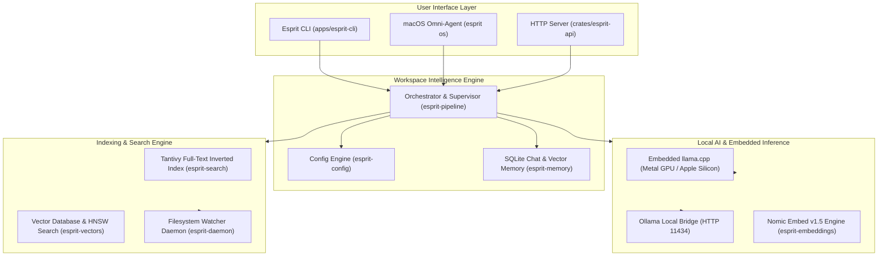

# Architecture & Technical Design

**Esprit** is architected as an air-gapped, local-first AI workspace and developer intelligence layer built with Rust. It provides high-throughput project indexing, low-latency semantic search, embedded Apple Silicon Metal inference, and structured agent workflows.

---

## 1. System Topology

---

## 2. Workspace Crates & Component Breakdown

The repository is organized into focused, modular crates under `crates/` and applications under `apps/`:

| Crate / Directory | Description & Responsibility |
| :--- | :--- |
| **`apps/esprit-cli`** | Primary user CLI binary (`esprit`). Parses subcommands and renders terminal UI. |
| **`crates/esprit-ai`** | Local LLM inference client (embedded `llama.cpp` Metal + Ollama client). |
| **`crates/esprit-agents`** | Autonomous agent runtime (`ChatAgent`, `CodeReviewAgent`, `SearchAgent`). |
| **`crates/esprit-rag`** | Retrieval-Augmented Generation pipeline (token chunking, vector scoring). |
| **`crates/esprit-index`** | High-throughput AST and code indexing engine with SQLite persistence. |
| **`crates/esprit-search`** | Tantivy-based full-text inverted index and boolean query parser. |
| **`crates/esprit-vectors`** | Cosine similarity & dense vector search engine for embeddings. |
| **`crates/esprit-daemon`** | Background filesystem watcher with automatic crash recovery and debounce. |
| **`crates/esprit-filesystem`** | Multi-threaded file hashing (SHA-256), duplicate detection, and file organizer. |
| **`crates/esprit-config`** | TOML configuration engine persisting settings to system application directories. |
| **`crates/esprit-platform`** | Hardware diagnostics, Metal GPU detection, and toolchain validator (`doctor`). |

---

## 3. Local Model Provisioning & Inference Flow

1. **Storage Topology**:
   * **macOS**: `~/Library/Application Support/dev.esprit.esprit/models/`
   * **Linux**: `~/.local/share/esprit/models/`
   * **Windows**: `%LOCALAPPDATA%\esprit\models\`
2. **Default Bundled Models**:
   * **Fast / Default LLM**: `qwen3:0.6b` (Qwen 2.5 0.5B Instruct Q4_K_M GGUF, ~390 MB).
   * **Balanced LLM**: `qwen3:1.7b` (Qwen 2.5 1.5B Instruct Q4_K_M GGUF, ~1.1 GB).
   * **Semantic Embedder**: `nomic-embed` (Nomic Embed Text v1.5 Q4_K_M GGUF, ~77 MB).
3. **Hardware Acceleration**:
   * On macOS, models are loaded directly into Apple Silicon Unified Memory via embedded Metal shaders (`llama.cpp`), utilizing GPU matrix multiplication with minimal memory overhead.

---

## 4. Privacy & Zero-Telemetry Contract

* **No External Data Leaks**: All processing, indexing, and LLM inferences take place entirely on the local machine.
* **Deterministic Execution**: Mutating operations (such as script execution or file organization) require explicit user consent.
